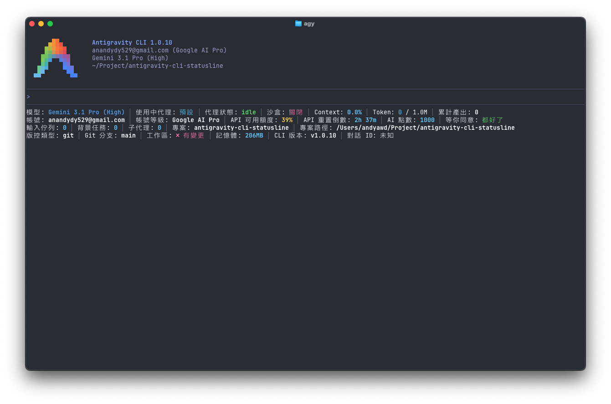
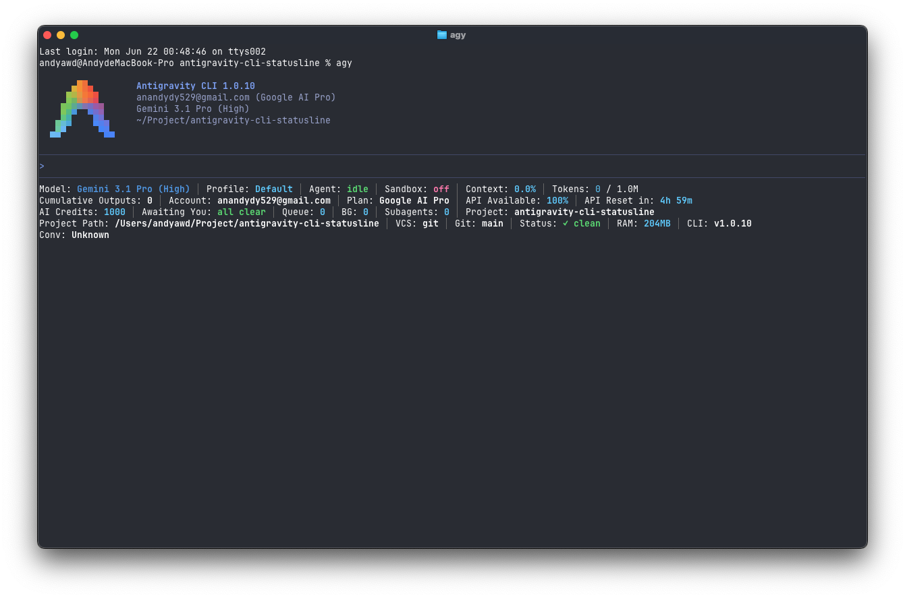
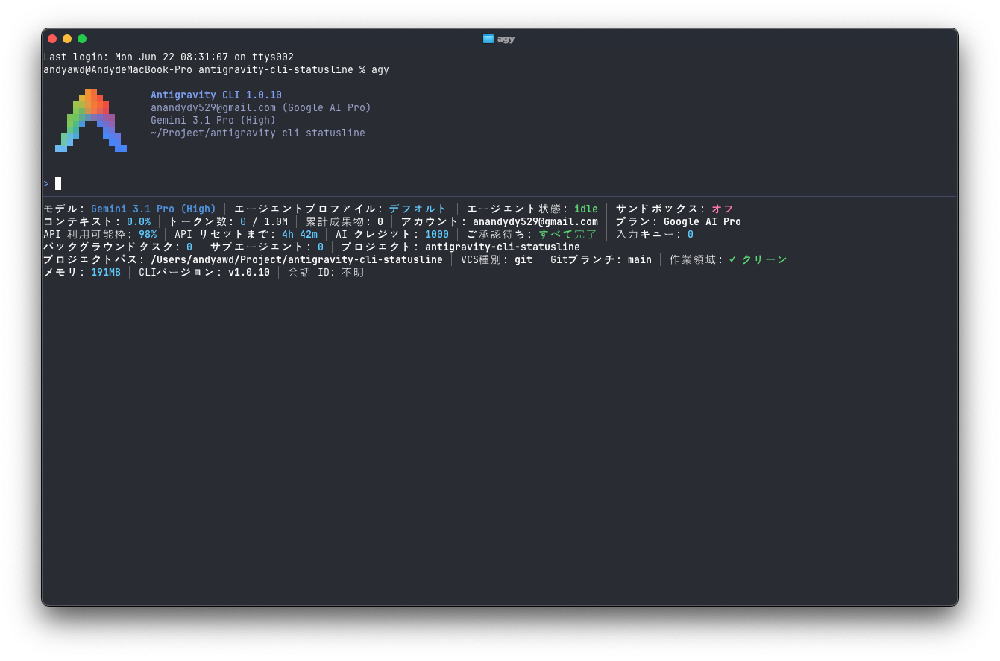

# GDG 2026 / 06 月特別場 — Google IO「使用 Antigravity 系列」

## 使用 Antigravity CLI 打造自己的 Status Line

---

## 講者介紹

<div style="display:flex; align-items:center; justify-content:center; gap:3.5rem; margin-top:1.2rem;">
  <div style="flex:0 0 352px; width:352px; height:352px; box-sizing:border-box;
              padding:6px; border-radius:50%;
              background: conic-gradient(from 135deg, #4285f4, #ea4335, #f9ab00, #34a853, #4285f4);
              box-shadow: 0 18px 40px rgba(0,0,0,0.18), 0 4px 12px rgba(0,0,0,0.10);">
    <div style="width:100%; height:100%; border-radius:50%; overflow:hidden;
                border:5px solid #f0f0f0; box-sizing:border-box; background:#fff;">
      
    </div>
  </div>
  <div style="font-size:1.15em;">
    <ul>
      <li>戴維廷 / Andy</li>
      <li>GDG Kaohsiung 組織者</li>
      <li>Android 工程師</li>
      <li>目前還是個人類</li>
    </ul>
  </div>
</div>

---

## 今日議程

1. **環境準備**：安裝 Antigravity CLI
2. **終端機移動路徑**：Windows 和 macOS 資料夾移動位置
3. **基本指令**：瞭解 Antigravity CLI 的內建指令操作
4. **深入實作**：做出自己的底部狀態列 Status Line

---

## 先搞懂主角：Antigravity 跟它的終端機版本

- **Antigravity**：Google 出的 AI 開發平台（AI Development Platform）
  - 講白話就是「會幫你寫 code、會幫你跑任務的 AI 代理（Agent）」
- **Antigravity CLI（`agy`）**：它的「終端機版本」
  - 官方定位：**給那種一整天都泡在終端機裡的人**
  - 不用跳出視窗、不用切來切去，就在你的黑底白字裡跟 AI 對話
- **Antigravity IDE**：有圖形介面的版本，跟 CLI 共用同一組帳號

Note:
官方主打的五個亮點（懶人版翻譯）：
- Work in Natural Language：用講的就好
- Snappy Experience：跑起來很輕
- Subagents：可以同時派好幾個分身（`/agents` 看進度、`Ctrl+K` 一鍵批准）
- Highly configurable：什麼都能調（`/config`、`/keybindings`）
- Slash Commands：斜線一打全有了（Plugins、MCP、Skills、Hooks）

今天我們玩哪一塊？就是「Highly configurable」裡面的——**底部狀態列**。CLI 最下面那一行，預設只有寥寥幾個字，但其實是一塊任你揮灑的小儀表板，可以塞模型名稱、剩餘額度、Git 分支、記憶體用量……愛塞什麼塞什麼。

---

## 環境準備：把 `agy` 裝到你的機器上

**官方下載頁**：<https://antigravity.google/download#antigravity-cli>

- 裝完跑 `agy --version` 確認版本
- 首次啟動會引導你用 Google 帳號認證（Authentication）

**macOS**

```bash
# Andy 待填：請於工作坊前貼上 macOS 安裝指令
```

**Windows**

```powershell
# Andy 待填：請於工作坊前貼上 Windows 安裝指令
```

**Linux**

```bash
# Andy 待填：請於工作坊前貼上 Linux 安裝指令
```

**裝完驗證**

```bash
agy --version    # CLI 版本
node -v          # Node.js 必裝（狀態列 Hook 依賴）
```

---

## 終端機移動路徑（Windows / macOS）

（待填）

---

## Antigravity CLI 基本指令

（待填）

---

## 為什麼用「漸進式提示詞工程」？

**把一頭大象切成 14 口**

- 一次給 AI 龐大需求 → 回應品質不穩、難以除錯
- 小步快跑 → 每一步都看得見、跑得動、改得起

**最終成果**

- 24 個可勾選 / 排序的指標（Metrics）
- 3 種語系：繁中 / 英文 / 日文
- 跨平台：Windows / macOS / Linux

Note:
學習目標：
1. 理解 Antigravity CLI 的底層鉤子（Hook）與排版更新機制
2. 掌握漸進式提示詞的設計核心：複雜任務拆解為微小、可獨立驗證的步驟
3. 整合系統行程監控、版本控制、API 用量、多語系、UI 真彩色美化

---

## 今日學習地圖

**Unit 1：核心觀念**
- 狀態列運作機制與架構
- Hook 腳本前置準備

**Unit 2：基礎建設（Prompt 0）**
- 主提示詞與 API 額度擷取
- 三層設定檔與 `trusted_hooks.json` 信任機制

**Unit 3：指標擴充（Prompt 1 – 10）**
- 模型名稱 → Context 用量 → 額度倒數 → 記憶體 → Git → 路徑
- 訂閱方案 → 代理狀態 → 任務流 → 系統環境

**Unit 4：使用者體驗（Prompt 11 – 13）**
- 多語系 i18n → 自訂排序與智慧折行 → 24-bit 真彩色

**Unit 5：總結與排錯**
- 熱更新與診斷工具

---

## 狀態列運作機制

**Antigravity CLI 怎麼更新最下面那一行？**

- **觸發點**：每次把終端機主控權還給使用者前，自動執行 Hook 腳本
- **資料來源**：CLI 把系統 metadata 用 JSON 從 stdin 傳給 Hook
- **時間限制**：50 毫秒內必須讀完，否則啟動器（`statusline_runner.go`）放生
- **安全機制**：所有 Hook 命令必須註冊在 `trusted_hooks.json`，否則直接拒絕

Note:
50ms 是設計關鍵——強迫所有 Hook 必須非阻塞、必須能優雅降級。如果你用同步 IO 等網路請求，鐵定超時。後面 Prompt 0 的 `readStdin()` 50ms Promise 就是為了這個。

---

## Hook 腳本前置準備

**動工前兩件事**

1. **檢查 Node.js**：跑 `node -v`
   - 沒裝 → 狀態列不更新，`.gemini/hook_error.log` 會狂噴錯
2. **建立目錄結構**
   - `~/.gemini/antigravity-cli/hooks/` — Hook 腳本放這
   - `~/.gemini/tmp/` — 非同步 fetch 的快取資料放這

Note:
Antigravity CLI 已於前面「環境準備」安裝完成，這裡只處理 Hook 額外需求。

---

## Prompt 0 — 狀態列基礎建設與 API 額度擷取

**新增指標**：`quota`（API 可用額度）

**這一關要做**
- 動態探測本機 Language Server 行程（PID + Port）
- 用 Connect Protocol 拿額度
- 寫進本機快取，由渲染腳本讀出來

**三道防線**
- 平台無關：Win 走 PowerShell、Unix 走 `ps auxww`
- 非阻塞：stdin 50ms 超時就放行
- 檔案安全：強制 UTF-8、剝除 BOM、子行程 `windowsHide: true`

```javascript
async function readStdin() {
  return new Promise((resolve) => {
    let data = '';
    const timer = setTimeout(() => resolve(data), 50);
    process.stdin.setEncoding('utf8');
    process.stdin.on('data', chunk => data += chunk);
    process.stdin.on('end', () => { clearTimeout(timer); resolve(data); });
  });
}
```

Note:
完整 Prompt 0（5 條規範）：
1. 探測 Language Server 行程：Win 用 `Get-CimInstance` 找含 `agy` 的行程，正規表示式抓 `--csrf_token`；Unix 用 `ps auxww`
2. 探測 Port：Win 用 `netstat -ano`、Unix 用 `lsof -nP -a -p <PID> -iTCP -sTCP:LISTEN`
3. Connect 協定 HTTPS POST 到 `127.0.0.1:<PORT>/exa.language_server_pb.LanguageServerService/GetUserStatus`，headers 帶 `Connect-Protocol-Version: 1` 與 `X-Codeium-Csrf-Token`，timeout 2000ms
4. 渲染腳本非阻塞讀 stdin，50ms 超時走預設值
5. 檔案寫入強制 UTF-8、剝 BOM、`windowsHide: true`

實際程式碼有 4 段：`findServerCandidates` / `getListeningPorts` / `requestUserStatus` / `readStdin`。slide 顯示的是 `readStdin`，因為它最能呈現「50ms 非阻塞」這個設計哲學。

---

## Prompt 0 — 註冊：三層設定檔與信任機制

**寫好腳本後，得告訴 CLI 去哪找它**

**三層 settings.json（優先級由高到低）**
1. CLI 專屬：`~/.gemini/antigravity-cli/settings.json` ⚠️ 最高優先，空 command 會無聲失效
2. 全域：`~/.gemini/settings.json`
3. 專案：`[workspace]/.gemini/settings.json`

**`trusted_hooks.json` 三鍵齊發**
- 當前工作區絕對路徑
- 家目錄絕對路徑
- 萬用字元 `"*"`

**Windows 額外**：路徑反斜線敏感，需同時寫絕對路徑與 `%USERPROFILE%` 兩種變體

```json
{
  "statusLine": {
    "enabled": true,
    "type": "command",
    "command": "node /Users/you/.gemini/antigravity-cli/hooks/statusline-quota.mjs"
  }
}
```

Note:
trusted_hooks.json 完整範例：
```
{
  "/Users/you/Project/myproject": ["statusLine:node /Users/you/.gemini/antigravity-cli/hooks/statusline-quota.mjs"],
  "/Users/you": ["statusLine:node /Users/you/.gemini/antigravity-cli/hooks/statusline-quota.mjs"],
  "*": ["statusLine:node /Users/you/.gemini/antigravity-cli/hooks/statusline-quota.mjs"]
}
```

CLI 專屬層的「空 command 陷阱」：如果 `/model` 切換指令誤把 command 設成空字串，整個 Hook 會無聲失效，且因為優先級最高還會壓過其他層。這是 pitfalls.md 記載的最常見坑。

---

## Prompt 1 — 顯示 AI 模型名稱

**新增指標**：`model-name`

**Prompt 摘要**

> 從 stdin metadata 提取模型名稱欄位；若缺失或解析失敗，回退到預設字串（如 `'default'`），確保任何環境都不會崩潰或漏出 `undefined`。

```javascript
let fallbackModel = 'Gemini 3.5 Flash (High)';
if (meta?.model?.display_name) fallbackModel = meta.model.display_name;
else if (meta?.model?.id) fallbackModel = meta.model.id;

function normalizeModelName(name) {
  return (name || '').toLowerCase().replace(/[^a-z0-9]+/g, '');
}
```

Note:
`normalizeModelName` 是為了當 cache key 用——例如 "Gemini 3.5 Flash (High)" 標準化成 "gemini35flashhigh"，方便檔名與比對。

---

## Prompt 2 — 上下文消耗量與 Token 統計

**新增指標**：`context-used`、`token-count`

**為什麼重要**：LLM 開發隨時要知道 context window 用了幾趴、token 燒了多少

**Prompt 摘要**
1. 從 stdin metadata 解析 context 使用率與 token 數
2. 資料缺失或型態錯誤 → 降級顯示 `'0%'` / `'0'`

```javascript
async function calculateContextUsageAsync(meta, conversationId) {
  const ctx = meta.context_window || {};
  let totalInput = ctx.total_input_tokens || 0;
  let usedPctNum = ctx.used_percentage || 0;
  let contextSize = ctx.context_window_size || 1048576; // 預設 1M

  // metadata 為空 → 讀本機快取；否則寫入快取備援
  // ... 完整快取讀寫邏輯略

  if (contextSize > 0 && totalInput > 0 && !usedPctNum) {
    usedPctNum = (totalInput / contextSize) * 100;
  }
  return { totalInput, contextSize, usedPctNum };
}
```

Note:
完整實作有快取讀寫（`~/.gemini/tmp/ctx_<conversationId>.json`）。設計重點：CLI 剛啟動還沒對話時 metadata 是空的，就讀上次的快取；有資料就寫入快取備援。

---

## Prompt 3 — API 額度重置倒數

**新增指標**：`quota-reset-countdown`

**Prompt 摘要**
1. 從快取或 metadata 讀重置 ISO 時間戳 / Epoch 毫秒
2. 動態計算差值 → 格式化成 `15m` / `2h 30m` / `1d 4h`
3. 用 UTC 計算避開時區地雷；無效時間就隱藏

```javascript
function formatResetTime(resetTimeStr) {
  try {
    const reset = new Date(resetTimeStr);
    const diffSec = Math.floor((reset.getTime() - Date.now()) / 1000);
    if (diffSec <= 0) return 'now';
    const minutes = Math.floor((diffSec + 59) / 60);
    if (minutes < 60) return `${minutes}m`;
    const hours = Math.floor(minutes / 60);
    const mins = minutes % 60;
    if (hours >= 24) {
      const days = Math.floor(hours / 24);
      return (hours % 24) ? `${days}d ${hours % 24}h` : `${days}d`;
    }
    return mins ? `${hours}h ${mins}m` : `${hours}h`;
  } catch { return ''; }
}
```

---

## Prompt 4 — CLI 行程記憶體監控

**新增指標**：`memory-usage`

**Prompt 摘要**
1. 抓 CLI 行程的 RSS 工作集大小 → 換算 MB
2. Win 用 PowerShell `Get-CimInstance Win32_Process`（**不能用棄用的 `wmic`**）
3. Unix 用 `ps`
4. 所有子行程必須 `windowsHide: true`，避免 Windows 黑框閃爍

```javascript
async function getCliMemoryMB() {
  try {
    if (process.platform === 'win32') {
      // Win：直接用 Node 行程 RSS，避開 wmic 棄用
      return Math.round(process.memoryUsage().rss / 1024 / 1024);
    } else {
      // Unix：透過 ps 抓 agy 父行程 RSS
      const output = await runCmdAsync(`ps -o rss= -p ${process.ppid}`);
      const memKb = parseInt(output.trim(), 10);
      if (!isNaN(memKb)) return Math.round(memKb / 1024);
    }
  } catch {}
  return Math.round(process.memoryUsage().rss / 1024 / 1024);
}
```

---

## Prompt 5 — Git 分支與工作區狀態

**新增指標**：`git-branch`、`vcs-dirty`、`vcs-type`

**Prompt 摘要**
1. 偵測 `.git` 存在 → 是 Git 專案
2. `git rev-parse --abbrev-ref HEAD` 拿分支名
3. `git status --porcelain` 判斷是否髒污
4. 非 Git 專案 / 沒裝 Git → try-catch 靜默降級
5. **絕不能中斷其他指標**

```javascript
async function getGitBranch(lang, projectPath) {
  try {
    const opts = { cwd: projectPath || process.cwd() };
    let branch = await runCmdAsync('git branch --show-current', opts);
    if (!branch) branch = await runCmdAsync('git rev-parse --abbrev-ref HEAD', opts);
    return branch || (lang === 'zh-tw' ? '無版本控制' : 'No VC');
  } catch {
    return lang === 'zh-tw' ? '無版本控制' : 'No VC';
  }
}
```

Note:
路徑解析必須相容 Windows 反斜線與 Unix 正斜線；執行 Git 指令時要繼承環境變數（PATH），確保找得到 `git` 執行檔。

---

## Prompt 6 — 專案路徑解析

**新增指標**：`project-path`、`project-full-path`

**Prompt 摘要**
1. 從 metadata 讀專案絕對路徑
2. 用 Node 內建 `path` 模組（**不要字串分割**，要相容 Windows 磁碟機代號 `C:`）
3. 確保 JSON 序列化時斜線不被誤解析

```javascript
const projectPath = (typeof meta?.project?.path === 'string' && meta.project.path)
  ? meta.project.path
  : process.cwd();

const projectName = basename(projectPath);   // 短：antigravity-cli-statusline
const projectFullPath = projectPath;         // 長：/Users/.../antigravity-cli-statusline
```

---

## Prompt 7 — 訂閱方案與帳號點數

**新增指標**：`plan-tier`、`account-email`、`ai-credits`

**Prompt 摘要**
1. 從 metadata 抓帳號等級、信箱、AI 點數
2. **信箱遮蔽（Email Masking）**：`user@example.com` → `us**@example.com`
3. 防止共享螢幕、簡報時外洩完整帳號

```javascript
async function manageAccountMetaCacheAsync(meta) {
  const cachePath = join(os.homedir(), '.gemini', 'tmp', 'account_meta_cache.json');
  let cached = {};
  try { cached = JSON.parse(await fs.readFile(cachePath, 'utf8')); } catch {}

  if (meta?.account && (meta.account.email || meta.account.plan_tier)) {
    Object.assign(cached, {
      email: meta.account.email,
      planTier: meta.account.plan_tier,
      aiCredits: meta.account.ai_credits
    });
    await fs.writeFile(cachePath, JSON.stringify(cached), { encoding: 'utf8' });
  }
  return cached;
}
```

Note:
為什麼要快取？因為帳號資訊在某些週期會暫時失效（API 暫斷、metadata 缺欄位）；快取讓畫面不會頻繁閃爍「---」。

---

## Prompt 8 — 代理狀態監控

**新增指標**：`agent-state`、`agent-profile`

**Prompt 摘要**
1. 解析 `idle` / `thinking` / `working` / `tool_use` / `initializing`
2. 字形相容降級：終端機未啟用 UTF-8 時，特殊 Unicode 圖示自動換 ASCII

```javascript
function getAgentStateColor(state) {
  const s = (state || '').toLowerCase();
  if (s.includes('error') || s.includes('fail')) return RED;
  if (s.includes('busy') || s.includes('run') || s.includes('think')) return YELLOW;
  if (s.includes('idle') || s.includes('ready')) return GREEN;
  return BLUE;
}

// 渲染: `${WHITE}代理狀態:${RESET} ${getAgentStateColor(m.agentState)}${BOLD}${m.agentState}${RESET}`
```

Note:
顏色設計哲學：黃 = AI 還在跑（你在等）、綠 = AI 等你、紅 = 出事了。一眼掃過就知道球在誰手上。

---

## Prompt 9 — 任務流與對話控制

**新增指標**：`tool-confirmation`、`pending-input`、`background-tasks`、`subagents`、`artifacts`

**Prompt 摘要**
1. 從 metadata 抓 5 個流量指標
2. **零值隱藏**：背景任務、子代理、待處理輸入為 0 時，整個指標不顯示
3. 只有非零才秀，避免狀態列被一堆 `0` 塞滿

```javascript
// 透過子代理 progress.md 修改時間判定活躍（5 分鐘內更新 = 活躍）
const dirs = await fs.readdir(join(projectPath, '.agents'));
const now = Date.now();
const results = await Promise.all(dirs.map(async (d) => {
  if (d.startsWith('.')) return 0;
  try {
    const stat = await fs.stat(join(projectPath, '.agents', d, 'progress.md'));
    return (now - stat.mtimeMs <= 300000) ? 1 : 0;
  } catch { return 0; }
}));
return results.reduce((a, b) => a + b, 0);
```

Note:
為什麼用 progress.md 修改時間？因為這是現有約定：每個子代理會把進度寫到自己的 progress.md。5 分鐘內有寫入 = 活躍中。

---

## Prompt 10 — 系統環境與沙盒狀態

**新增指標**：`cli-version`、`conversation-id`、`sandbox-status`

**Prompt 摘要**
1. 從 metadata 抓 CLI 版本與沙盒聯網狀態（`off` / `on (net)` / `on (no-net)`）
2. **對話 ID 安全截短**：長 UUID 取前 8 碼
3. 缺失就顯示 `N/A`，**避開 `substring` 崩潰**

```javascript
const rawConvId = typeof meta?.conversation_id === 'string' ? meta.conversation_id : '';
const conversationIdShort = rawConvId
  ? rawConvId.replace(/-/g, '').slice(0, 8)
  : 'N/A';

function getSandboxColor(enabled, allowNet) {
  if (!enabled) return RED;            // 未啟用 → 警告
  return allowNet ? YELLOW : GREEN;     // 啟用但聯網 → 提醒；斷網 → 安全
}
```

---

## Prompt 11 — 多語系國際化（i18n）

**新增指標**：`zh-tw` / `us` / `jp` 三語切換

**Prompt 摘要**
1. 讀設定檔 `ui.language`
2. 動態切換所有指標的標題、狀態描述
3. 字典必須 UTF-8 無 BOM，避免 Windows 編碼污染

<div style="display:flex; gap:0.8rem; justify-content:center; margin-top:1rem;">
  <figure style="margin:0; text-align:center;">
    
    <figcaption style="font-size:0.7em;">繁體中文（zh-tw）</figcaption>
  </figure>
  <figure style="margin:0; text-align:center;">
    
    <figcaption style="font-size:0.7em;">英文（us）</figcaption>
  </figure>
  <figure style="margin:0; text-align:center;">
    
    <figcaption style="font-size:0.7em;">日文（jp）</figcaption>
  </figure>
</div>

Note:
完整字典共 24 個 key × 3 語系 = 72 條對應。設計重點：每條 value 都是「白色標籤 + 重置 + 動態顏色 + 粗體 + 值 + 重置」的固定 pattern，方便維護。

字典結構範例：
```js
function buildI18nDict(lang, m) {
  const dicts = {
    'zh-tw': {
      'model-name': `${WHITE}模型:${RESET} ${color}${BOLD}${m.fallbackModel}${RESET}`,
      'quota':      `${WHITE}API 可用額度:${RESET} ${m.quotaColor}${BOLD}${m.quotaVal}${RESET}`,
      // ... 共 24 條
    },
    'us':  { 'model-name': `${WHITE}Model:${RESET} ...`, /* ... */ },
    'jp':  { 'model-name': `${WHITE}モデル:${RESET} ...`, /* ... */ }
  };
  return dicts[lang] || dicts['zh-tw'];
}
```

---

## Prompt 12 — 自訂排序與智慧折行

**新增指標**：`n` / `newline` 強制換行 + 智慧折行

**Prompt 摘要**
1. 讀 `ui.footer.items` 陣列，**完全照順序**渲染
2. 遇到 `n` 或 `newline` → 強制換行
3. **智慧折行**：累計超過終端機寬度 → 自動換行
4. 寬度讀不到就用 80 / 120 預設，避免無窮迴圈

```javascript
function stripAnsi(str) {
  return str.replace(/[\u001b\u009b][[()#;?]*(?:[0-9]{1,4}(?:;[0-9]{0,4})*)?[0-9A-ORZcf-nqry=><]/g, '');
}

function getDisplayWidth(str) {
  let width = 0;
  for (let i = 0; i < str.length; i++) {
    width += str.charCodeAt(i) > 0x7F ? 2 : 1;  // 全形=2、半形=1
  }
  return width;
}
```

Note:
完整 `renderStatusLine` 外圍是迴圈：逐個 footerItem 累計加入當前行，超寬就 push 到 lines、起新行。重點是「寬度計算前先 stripAnsi」這步——色彩碼動輒 10+ 字元卻不佔視覺寬度，不剝除會嚴重低估剩餘空間。

四種運作機制：
- **色彩碼剝除**：`\x1b[38;2;...m` 不佔螢幕寬度，要先剝
- **雙位元組估計**：中文佔 2 格、英文佔 1 格，不能用 `.length`
- **智慧折行決策**：當前行寬 + 新指標寬 > 終端寬 → 換行
- **強制折行**：遇 `n` / `newline` 立即截斷

---

## Prompt 13 — 24-bit 真彩色四階配色

**四階健康度配色**
- 藍 `#57caff` — 額度 ≥ 75%（充裕）
- 綠 `#5cdb6d` — 額度 ≥ 50%（健康）
- 黃 `#ffd427` — 額度 ≥ 25%（警示）
- 紅 `#ff7daf` — 額度 < 25%（危險）

**降級**：舊版 Windows 主控台不支援 24-bit → 換 ANSI 16 色或純粗體

```javascript
const BLUE   = "\x1b[38;2;87;202;255m";   // RGB(87,202,255)
const GREEN  = "\x1b[38;2;92;219;109m";   // RGB(92,219,109)
const YELLOW = "\x1b[38;2;255;212;39m";   // RGB(255,212,39)
const RED    = "\x1b[38;2;255;125;175m";  // RGB(255,125,175)

function getColorByPercentage(pct) {
  if (pct >= 75) return BLUE;
  if (pct >= 50) return GREEN;
  if (pct >= 25) return YELLOW;
  return RED;
}
```

---

## 熱更新與故障診斷

**Hot Reload 機制**
- 狀態列每次執行都**重讀三層設定檔**
- 不用重啟 CLI、不用重啟終端機
- 改設定 → 下一次按鍵就生效

**`diagnose-statusline.mjs`（唯讀）**
1. 三層 settings.json 配置檢測
2. **BOM 污染偵測**（`EF BB BF` → Go 解析器崩潰）
3. `trusted_hooks.json` 信任狀態核對
4. **空 command 漏洞**（CLI 專屬層常被覆寫成空 → 整個 Hook 無聲失效）

```javascript
function hasBOM(buf) {
  return buf && buf.length >= 3 && buf[0] === 0xEF && buf[1] === 0xBB && buf[2] === 0xBF;
}

function diagnose(layers) {
  const cli = layers.cli?.data;
  if (cli && 'statusLine' in cli && !cli.statusLine?.command) {
    console.log('🚨 CLI 專屬層 statusLine.command 為空 → Hook 不會被呼叫');
    console.log('   → pitfalls.md 陷阱（可能 /model 覆寫所致）');
    console.log('   → 建議：重跑技能同步覆寫三層');
  }
}
```

---

## 總結：漸進式提示詞工程

**為什麼有效？**
- **小步快跑**：14 個 Prompt，每個獨立可驗證
- 跟「一次給龐大需求」相比，能精準掌控品質、容易回退

**兩個核心實踐**

1. **平台無關自然語言**：描述「邏輯目標」而非「實作細節」
   - ✅ 「在 Windows 上用 netstat，在 Unix 上用 lsof」
   - ✅ 「寫檔強制 UTF-8 並檢查 BOM」
   - ❌ 硬編碼某個系統的指令路徑

2. **錯誤隔離（Fault Isolation）**：每個指標都被 try-catch 包住
   - 單一指標失效 → 靜默降級
   - **絕不中斷其他指標的渲染**

---

## 把今天的儀表板帶回家

**本工作坊開源專案**

- GitHub：<https://github.com/AndyAWD/antigravity-cli-statusline>
- 安裝：`agy plugin install ...`
- 一鍵設定：`/antigravity-cli-statusline`

**官方資源**

- Antigravity CLI 下載：<https://antigravity.google/download#antigravity-cli>
- GDG Kaohsiung 社群

**延伸閱讀**

- 專案 `README.zh-TW.md`：完整安裝與設定
- 專案 `skills/antigravity-cli-statusline/SKILL.md`：設定精靈技能
- 本簡報原始檔：`docs/workshop/prompt-workshop-slides.md`

---

## Thank You

**感謝**

- GDG Kaohsiung 與 Google Developer 社群提供舞台
- 每一位願意把終端機底部留給狀態列的你

**期待下一次 GDG 活動再見**
